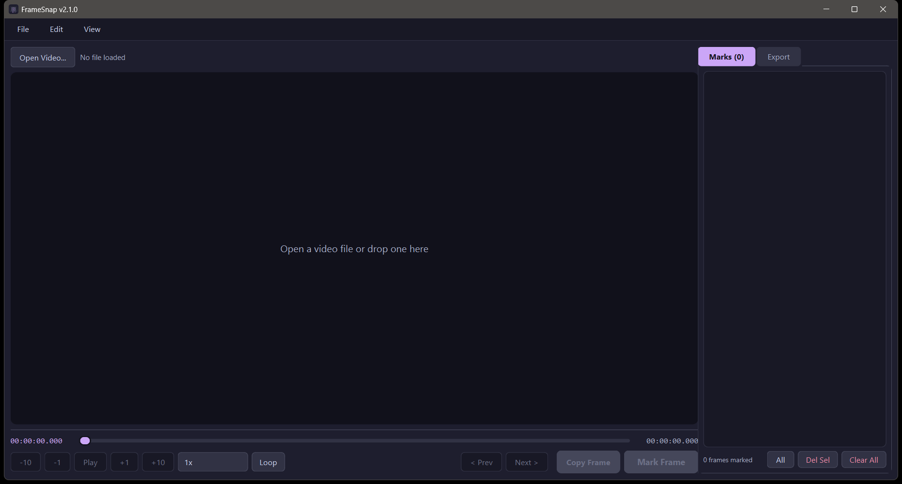

<!-- codex-branding:start -->
<p align="center"></p>

<p align="center">
  
  
  
</p>
<!-- codex-branding:end -->

# FrameSnap

> Browse any video, mark frames visually, and export precise screenshots — all in a dark, polished desktop app.


---




## Features

### Video Playback

- Open MP4, AVI, MOV, MKV, WMV, FLV, WebM, TS, MTS, M2TS, MXF, OGV, 3GP, VOB, DV, and 30+ other formats
- FFmpeg backend with OS fallback for maximum format compatibility
- Play/Pause with native FPS timing
- **Speed control** — 0.25x, 0.5x, 1x, 2x, 4x playback speed
- **Loop mode** — toggle continuous looping during playback
- Step frame-by-frame (-10, -1, +1, +10)
- Drag scrubber to any position
- **Mouse wheel** on the video to step frames
- **Drag-and-drop** a video file directly onto the window
- Recent files menu for quick access

### Scrubber
- **Live hover preview** — floating thumbnail with timestamp follows your cursor along the scrubber
- **Mark tick indicators** — colored ticks drawn directly on the scrubber, each using the mark's assigned color

### Frame Marking
- **Mark current frame** with one click — thumbnail + timestamp added to the Marks panel
- **Per-mark colors** — right-click any mark to assign a color (Default/Red/Green/Blue/Orange/Yellow/Teal)
- **Per-mark labels** — right-click any mark to add a custom label (shown in italic)
- **Jump to frame** from any mark via "Go" button or right-click menu
- **Prev / Next mark** navigation buttons for quick cycling
- **Multi-select** marks with Ctrl/Shift+Click, then bulk delete selected
- Marks are kept sorted by time and persist in sessions

### Export

- **Formats:** PNG (lossless), JPEG, WebP, TIFF, BMP, or animated GIF
- **Quality control** for JPEG and WebP (1–100%)
- **Scale:** 100%, 75%, 50%, 25%, or custom pixel width
- **Filename template** with variables:
  - `{stem}` — video filename without extension
  - `{frame}` — zero-padded frame number (e.g. `001234`)
  - `{ts}` — timestamp as `HH-MM-SS-mmm`
  - `{label}` — custom mark label (or `mark` if unset)
  - `{n}` — sequential mark number
- **Animated GIF** — exports all marked frames as a single looping GIF via Pillow
- **Contact Sheet** — assembles all marked frames into a single PNG grid with timestamps
- **Open Folder** button to reveal the export directory in Explorer / Finder
- **Copy to Clipboard** — copy the current frame or any mark's frame directly

### Sessions

- **Save Session** — stores video path + all marks + labels + colors to a `.fsnap` JSON file
- **Load Session** — restores video, marks, labels, and colors from a session file

### UX

- **Frame overlay** on video display — shows frame number, total frames, and timestamp (toggleable via View menu)
- **Video info bar** — resolution, FPS, duration, frame count, file size shown on load
- Preferences auto-saved (output folder, format, quality, scale, template, overlay state, speed)
- Catppuccin Mocha dark theme throughout

---

## Requirements

- Python 3.10+
- Dependencies are **auto-installed on first run**: `PyQt6`, `opencv-python`, `numpy`, `Pillow`

---

## Installation & Usage

```bash
git clone https://github.com/SysAdminDoc/FrameSnap.git
cd FrameSnap
python framesnap.py
```

On first launch, missing packages are installed automatically via pip. No manual setup required.

---

## Workflow

1. **Open** a video via `File > Open Video...`, the button, or drag-and-drop
2. **Scrub** the timeline — hover to preview any frame
3. **Navigate** with play, step buttons, or mouse wheel on the video
4. **Mark** frames with the purple **Mark Frame** button
5. **Label / color** marks via right-click → Edit Label / Set Color
6. Switch to the **Export** tab
7. Choose format, quality, scale, and a filename template
8. Click **Export All Frames** (or **Contact Sheet...** for a grid overview)

---

## Supported Formats

FrameSnap uses OpenCV's FFmpeg backend and accepts any container/codec FFmpeg supports, including:

- **Common:** `.mp4` `.mov` `.avi` `.mkv` `.wmv` `.flv` `.webm`
- **Transport streams:** `.ts` `.mts` `.m2ts` `.m2t`
- **MPEG:** `.mpg` `.mpeg` `.mpe` `.m2v` `.m4v`
- **Professional:** `.mxf` `.dv` `.y4m`
- **Legacy / Other:** `.ogv` `.3gp` `.3g2` `.asf` `.vob` `.divx` `.rm` `.rmvb` `.f4v` `.amv` `.gif` `.bik` `.smk` `.roq` `.swf` `.mjpeg`

---

## Keyboard-Free Design

FrameSnap is designed for pure mouse/GUI operation. All actions are accessible through visible controls, right-click context menus, and the menu bar.

---

## License

MIT — see [LICENSE](LICENSE)
