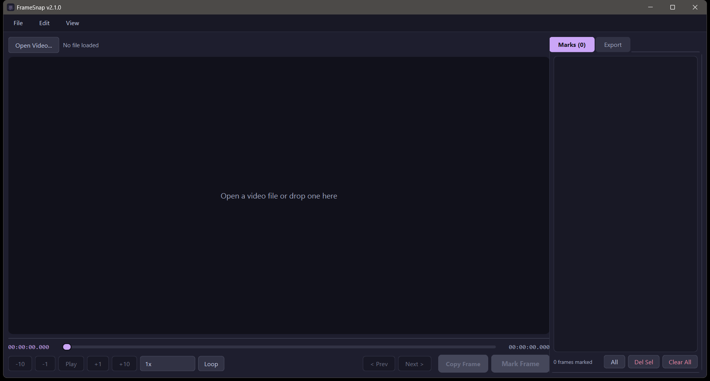

# FrameSnap

> Browse any video, mark frames visually, and export precise screenshots — all in a dark, polished desktop app.


---




## Features

### Video Playback

- Open MP4, AVI, MOV, MKV, WMV, FLV, WebM, TS, MTS, M2TS, MXF, OGV, 3GP, VOB, DV, and 30+ other formats
- FFmpeg backend with OS fallback for maximum format compatibility
- Play/Pause with native FPS timing
- **Speed control** — 0.25x, 0.5x, 1x, 2x, 4x playback speed
- **Loop mode** — toggle continuous looping during playback
- Step frame-by-frame (-10, -1, +1, +10)
- Drag scrubber to any position
- **Mouse wheel** on the video to step frames
- **Per-video mouse-wheel step** — configure 1–1000 frames per notch from Edit → Set Mouse-Wheel Step
- **Side-by-side A/B viewer** — compare two files by frame index or presentation time, with signed B offsets and per-source identity overlays
- **Frame/time identity** — marks retain frame index plus presentation timestamp/time base when the decoder provides them; Exact frame, Approximate keyframe, and Nearest timestamp seeking are explicit
- **Drag-and-drop queue** — drop several videos at once, then move through the queue with the
  previous/next controls while reusing marks and export settings
- Recent files menu for quick access

### Scrubber
- **Live hover preview** — floating thumbnail with timestamp follows your cursor along the scrubber
- **Mark tick indicators** — colored ticks drawn directly on the scrubber, each using the mark's assigned color

### Frame Marking
- **Mark current frame** with one click — thumbnail + timestamp added to the Marks panel
- **Per-mark colors** — right-click any mark to assign a color (Default/Red/Green/Blue/Orange/Yellow/Teal)
- **Per-mark labels** — right-click any mark to add a custom label (shown in italic)
- **Jump to frame** from any mark via "Go" button or right-click menu
- **Prev / Next mark** navigation buttons for quick cycling
- **Multi-select** marks with Ctrl/Shift+Click, then bulk delete selected
- Marks are kept sorted by time and persist in sessions with their available frame/time identity
- **Find Similar Frames** — perceptual-hash scan with configurable sampling to identify near-duplicates
- **QR/barcode detection** — decode codes from the current frame through Edit → Detect QR/Barcodes

### Export

- **Formats:** PNG, JPEG, WebP, TIFF, 16-bit TIFF, BMP, AVIF, EXR, animated GIF, or animated WebP
- **Quality control** for JPEG, WebP, animated WebP, and AVIF (1–100%)
- **Scale:** 100%, 75%, 50%, 25%, or custom pixel width
- **Burn-in overlay** — optionally bake frame number, timestamp, and label into every export
- **Crop rectangle** — apply one reusable crop to every exported frame
- **Filename template** with variables:
  - `{stem}` — video filename without extension
  - `{frame}` — zero-padded frame number (e.g. `001234`)
  - `{ts}` — timestamp as `HH-MM-SS-mmm`
  - `{label}` — custom mark label (or `mark` if unset)
  - `{n}` — sequential mark number
- **Animated GIF / WebP** — exports all marked frames as one looping animation via Pillow
- **Contact Sheet** — configurable title, watermark, column count, and optional PDF output
- **FFmpeg Commands** — show replayable single-frame extraction commands for every mark
- **Open Folder** button to reveal the export directory in Explorer / Finder
- **Copy to Clipboard** — copy the current frame or any mark's frame directly

### Sessions

- **Save Session** — stores video path + all marks + labels + colors to a `.fsnap` JSON file
- **Load Session** — restores video, marks, labels, and colors from a session file
- **Merge Sessions** — combine two sessions for the same video, unioning tags and notes
- **Compare Sessions** — show added, removed, and changed marks
- **Session Templates** — save relative timestamps to `.fstpl` and apply them to another video

### UX

- **Frame overlay** on video display — shows frame number, total frames, and timestamp (toggleable via View menu)
- **Video info bar** — resolution, FPS, duration, frame count, file size shown on load
- Preferences auto-saved (output folder, format, quality, scale, template, overlay state, speed)
- **Themes:** Catppuccin Mocha, Catppuccin Latte, GitHub Dark, AMOLED Black, and High Contrast
- **Keyboard/accessibility parity:** named controls, predictable Tab order, keyboard playback/mark navigation, and Shift+F10 mark actions
- Windows per-monitor-v2 DPI awareness is enabled before Qt creates the application window

---

## Requirements

- Python 3.10+
- PyQt6, opencv-python, numpy, and Pillow
- Optional PyAV enables the alternate decoder and audio-track metadata path
- Windows CPython 3.12 x64 releases can use the hash-locked runtime manifest at
  packaging/requirements-win-py312.txt

---

## Installation & Usage

```bash
git clone https://github.com/SysAdminDoc/FrameSnap.git
cd FrameSnap
python framesnap.py
```

FrameSnap does not install packages at runtime or modify the active Python environment. For a
regular development install, create a virtual environment and install the project:

```bash
python -m venv .venv
# Windows:
.venv\Scripts\python -m pip install -e ".[pyav]"
# macOS/Linux:
.venv/bin/python -m pip install -e ".[pyav]"
```

For a clean Windows CPython 3.12 x64 runtime, install the pinned, hash-verified manifest instead:

```bash
.venv\Scripts\python -m pip install --require-hashes --only-binary=:all: \
  -r packaging/requirements-win-py312.txt
```

If a dependency is missing, the application exits with the exact installation command rather than
silently changing the interpreter.

To build the unsigned Windows executable from source, run `pwsh packaging/build-windows.ps1`.

### Noninteractive batch export

Use a CSV or JSON marker list without opening the GUI. Rows may contain `frame` or `time_ms` (or
`time` as seconds / `HH:MM:SS.mmm`), plus an optional `label`, `tags`, and `comment`. Include
`video_path` per row or provide `--video`:

```bash
python framesnap.py --batch-markers markers.csv --video clip.mp4 \
  --output-dir exports --format PNG --burn-in
```

Batch export writes a hidden, atomic `.framesnap-<markers>.export.json` manifest in the output
folder. Re-running the same command resumes only after each completed output's SHA-256 matches the
manifest. Use `--manifest path.json` to choose another manifest, `--no-resume` to reprocess the
list, and `--collision suffix|skip|overwrite` to choose the existing-file policy. The default
`suffix` policy creates a numbered copy and never silently overwrites an existing export. The
command returns a nonzero exit code if any listed frame cannot be read or written.

### Linux packages

Release builds include an unsigned `FrameSnap.AppImage` for portable Linux use and an unsigned
`FrameSnap.flatpak` bundle for Flatpak-based desktops. Run the AppImage directly, or install the
Flatpak bundle with `flatpak install --user ./FrameSnap.flatpak`.

---

## Workflow

1. **Open** a video via `File > Open Video...`, the button, or drag-and-drop
2. **Scrub** the timeline — hover to preview any frame
3. **Navigate** with play, step buttons, or mouse wheel on the video
4. **Mark** frames with the purple **Mark Frame** button
5. **Label / color** marks via right-click → Edit Label / Set Color
6. Switch to the **Export** tab
7. Choose format, quality, scale, and a filename template
8. Click **Export All Frames** (or **Contact Sheet...** for a grid overview)

---

## Supported Formats

FrameSnap uses OpenCV's FFmpeg backend and accepts any container/codec FFmpeg supports, including:

- **Common:** `.mp4` `.mov` `.avi` `.mkv` `.wmv` `.flv` `.webm`
- **Transport streams:** `.ts` `.mts` `.m2ts` `.m2t`
- **MPEG:** `.mpg` `.mpeg` `.mpe` `.m2v` `.m4v`
- **Professional:** `.mxf` `.dv` `.y4m`
- **Legacy / Other:** `.ogv` `.3gp` `.3g2` `.asf` `.vob` `.divx` `.rm` `.rmvb` `.f4v` `.amv` `.gif` `.bik` `.smk` `.roq` `.swf` `.mjpeg`

---

## Keyboard-Free Design

FrameSnap is designed for direct local GUI operation. All actions are accessible through visible controls, keyboard shortcuts, Shift+F10 mark actions, context menus, and the menu bar.

---

## License

MIT — see [LICENSE](LICENSE)
